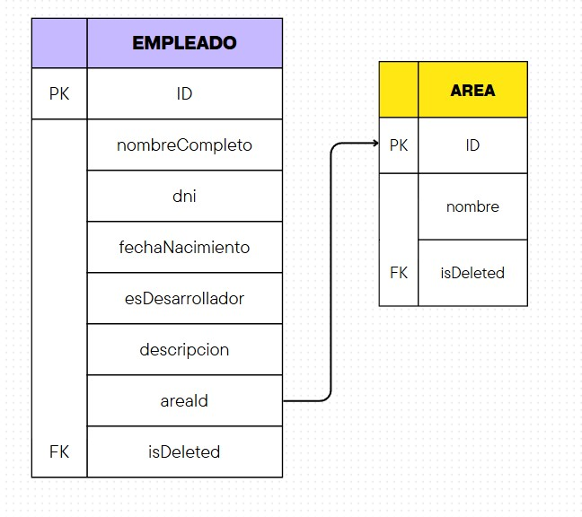

# Challenge de Ingreso - Gobierno de la Ciudad de Buenos Aires

Este proyecto es una aplicación **CRUD de Gestión de Empleados** desarrollada como parte del Challenge de Ingreso del Gobierno de la Ciudad de Buenos Aires. Se divide en:

- **Frontend** con Next.js + React + TypeScript
- **API** con Node.js + Express + Prisma ORM + MySQL

---

## Instalación y Configuración

### **1️⃣ Clonar el repositorio**

```sh
 git clone https://github.com/MilagrosLuna/
 cd 
```

### **2️⃣ Instalar dependencias**


#### Frontend (Next.js)

```bash
cd front
npm install
```

#### Backend (Node.js API)

```bash
cd back
npm install
```


### **3️⃣ Configurar variables de entorno**
#### Frontend

Crear `.env.local` en `front/` con:

```env
NEXT_PUBLIC_API_URL=http://localhost:4000/api
```

#### Backend

Crear `.env` en `back/` con:

```env
DATABASE_URL="mysql://root:@localhost:3306/crud_empleados"
```
o la correspondiente a tu sistema de gestión de MySQL

### **4️⃣ Base de datos MySQL**
Elegí MySQL ya que al ser un proyecto de dos tablas y una relación simple, es más sencillo mantener de forma ordenada la relación entre empleados y áreas. Para que la aplicación funcione correctamente, es necesario importar la base de datos en el sistema de gestión de MySQL que estés utilizando (MySQL Workbench, phpMyAdmin, línea de comandos, etc.) o crearla manualmente con el siguiente esquema:

```sql
CREATE DATABASE crud_empleados;

USE crud_empleados;

CREATE TABLE Area (
  id INT AUTO_INCREMENT PRIMARY KEY,
  nombre VARCHAR(255) NOT NULL,
  isDeleted BOOLEAN DEFAULT false
);
CREATE TABLE Empleado (
  id INT AUTO_INCREMENT PRIMARY KEY,
  nombreCompleto VARCHAR(255) NOT NULL,
  dni VARCHAR(20) UNIQUE NOT NULL,
  fechaNacimiento DATE NOT NULL,
  esDesarrollador BOOLEAN NOT NULL,
  descripcion TEXT NOT NULL,
  areaId INT NOT NULL,
  isDeleted BOOLEAN DEFAULT false,
  FOREIGN KEY (areaId) REFERENCES Area(id)
);
INSERT INTO Area (nombre) VALUES ('Recursos Humanos');
INSERT INTO Empleado (
  nombreCompleto, dni, fechaNacimiento, esDesarrollador,
  descripcion, areaId
) VALUES (
  'Juan Pérez', '12345678', '2000-05-12', true,
  'Frontend developer', 1
);

```
### DER



### **5️⃣ Levantar servicios**

- **API**:

  ```bash
  cd back
  npm run dev
  ```

  (> escucha en puerto 4000)

- **Frontend**:

  ```bash
  cd front
  npm run dev
  ```

  (> [http://localhost:3000](http://localhost:3000))

---

## 📚 API Documentada (Swagger)

Accedé a `http://localhost:4000/docs` para ver la interfaz interactiva.

---

## 📌 Endpoints de la API

| Método | Ruta                 | Descripción                 |
| ------ | -------------------- | --------------------------- |
| GET    | `/api/empleados`     | Listar empleados activos    |
| POST   | `/api/empleados`     | Crear un nuevo empleado     |
| PUT    | `/api/empleados/:id` | Editar datos de un empleado |
| DELETE | `/api/empleados/:id` | Baja lógica (soft delete)   |
| GET    | `/api/areas`         | Listar áreas                |
| POST   | `/api/areas`         | Crear una nueva área        |
| PUT    | `/api/areas/:id`     | Editar datos de un área     |
| DELETE | `/api/areas/:id`     | Baja lógica (soft delete)   |

---

## 📌 Estimación de tareas

| Tarea                                   | Tiempo estimado |
| --------------------------------------- | --------------- |
| Setup repositorios y entorno            | 30 min          |
| Modelado BD y Prisma (API)              | 1 h             |
| Implementación de rutas REST (API)      | 2 h             |
| Desarrollo frontend (Next.js)           | 2 h             |
| Documentación (Swagger/README)          | 1 h             |


---

📌 **Autor:** [Milagros Luna]
